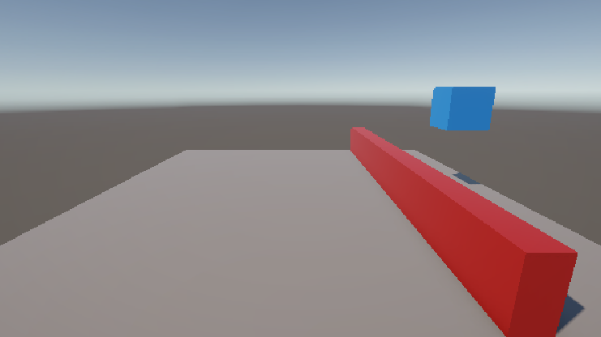
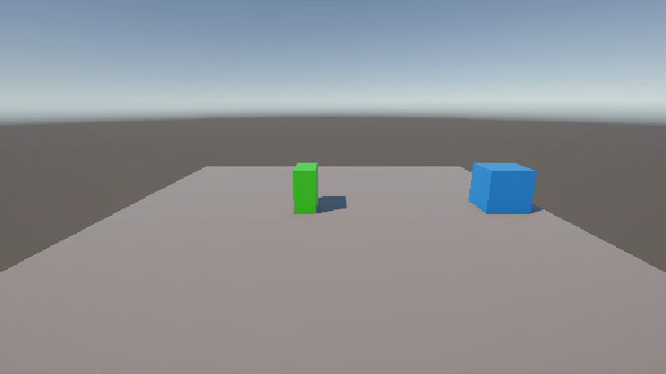
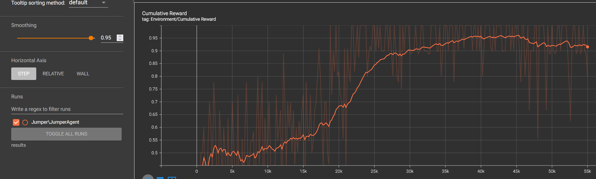

### Jumper


The blue cube is the jumper agent, the red line is an obstacle, the green box is a collectable.
The agent gets rewarded for jumping over obstacles and collecting collectables, no reward is given if it jumps over the collectable or hits the obstacle.

- Set-up: A jumping task, where the agent jumps over obstacles and doesn't jump to collect collectables.
- Goal: Jump over the obstacles, collect the collectables.
- Agents: The environment contains 1 agent.
- Agent Reward Function:
    - +1 if the agent jumps over an obstacle.
    - +1 if the agent hits the collectable.
    - +0 if the agent hits the obstacle.
    - +0 if the agent jumps over the collectable.
- Behavior Parameters:
    - Vector Observation space: 2 variables: the y-position of the agent and a boolean that corresponds to if there is an obstacle coming or a collectable.
     There is also 1 ray-cast coming from the agent, pointing left.
    - Actions: 1 discrete action: Jumping, the agent can decide to jump or not.
    - Visual Observations: None.
- Float Properties: 1
    - Jump Speed: the upwards speed that is given to the agent when it jumps
        - Default: 6
	    - Recommended Minimum: 4.75
	    - Recommended Maximum: 6.5
- Benchmark Mean Reward: 0.85
### How to reproduce
1. Add a plane and cube (our agent) to the scene, give the cube a unique color to be able to distinguish it easily.
2. Create a JumperAgent script and add it to the agent, along with the BehaviourParemeters, DecisionRequester and RayPerceptionSensor3D scripts.
3. Set the RaysPerDirection field of the RayPerceptionSensor3D script to 0. (this will make it so that there is only 1 ray)
4. Create a Move script.
5. Create 2 cubes (obstacle and collectable) and give them different colors and add the Move script to them.
6. Edit the Move script and add this code:
```cs
private void Start()
{
    GetComponent<Rigidbody>().linearVelocity = Vector3.forward * (Random.value + 1) * 4; // 4 - 8
}
```
8. This will make the obstacle/collectable have a variable speed (between 4 and 8).
9. Save both of these as 2 assets in your project.
10. Edit the JumperAgent script.
11. Make it inherit from Agent.
```cs
public class JumperAgent : Agent
```
8. Add these fields to the script:
```cs
[SerializeField] float jumpSpeed = 6f;
[SerializeField] LayerMask groundLayer;

[Header("Objects")]
[SerializeField] GameObject obstacle;
[SerializeField] GameObject collectable;

GameObject spawnedObject;
bool spawnedObjectIsObstacle;
bool hitObject;
```
11. Create a layer called "Ground", set the layer of the plane to this, and then add set the groundLayer field of the agent to this layer too.
12. Set the obstacle field to the obstacle asset and the collectable field to the collectable asset.
13. Add this method to the script:
```cs
private void resetPositionAndVelocity()
{
    transform.localPosition = new Vector3(0, .5f, 4);
    transform.localRotation = Quaternion.Euler(0, 180, 0);
    GetComponent<Rigidbody>().angularVelocity = Vector3.zero;
    GetComponent<Rigidbody>().linearVelocity = Vector3.zero;
}
``` 
14. Edit the values if needed.
15. Add this method to the script:
```cs
private void spawnObstacleOrCollectable()
{
    if (Random.value >= .5f)
    {
        spawnedObject = Instantiate(obstacle);
        spawnedObjectIsObstacle = true;
    }
    else
    {
        spawnedObject = Instantiate(collectable);
        spawnedObjectIsObstacle = false;
    }
    spawnedObject.transform.position = new Vector3(0, 0.5f, -5);
}
```
16. Edit any values if needed.
17. Add this method to the script:
```cs
void OnTriggerEnter(Collider other)
{
	//check if other is a collectable/obstacle
    if (other.gameObject.GetComponent<Move>() != null)
    {
        hitObject = true;
    }
}
```
16. Override the OnEpisodeBegin method in the script, this will initialize the scene for every episode:
```cs
public override void OnEpisodeBegin()
{
    hitObject = false;
    Destroy(spawnedObject);
    resetPositionAndVelocity();
    spawnObstacleOrCollectable();
}
```
17. Set the Space Size of the Vector Observations in the BehaviourParameters script on the agent to 2.
18. Override the CollectObservations method in the script, our agent will know it's vertical position, and wether the object is an obstacle or collectable. (ray cast observations are added automatically)
```cs
public override void CollectObservations(VectorSensor sensor)
{
    sensor.AddObservation(transform.localPosition.y);
    sensor.AddObservation(spawnedObjectIsObstacle);
}
```
19. Add this method to the script:
```cs
private void endEpisodeAndGiveReward()
{
    if (spawnedObjectIsObstacle)
    {
        //didn't touch obstacle during episode
        AddReward(1);
    }
    EndEpisode();
}
```
20. Set the Discrete Branch in Actions in the BehaviourParamers script to 1, and the Branch 0 Size to 2. (this is for the jump action)
21. Create the OnActionReceived method:
```cs
public override void OnActionReceived(ActionBuffers actionBuffers)
{
}
```
22. Add this code to the OnActionReceived method:
```cs
// 0 = don't jump, 1 = jump
if(actionBuffers.DiscreteActions[0] == 1 &&
    Physics.Raycast(
        transform.position,
        Vector3.down,
        .6f,
        groundLayer
    )
)
{
    GetComponent<Rigidbody>().linearVelocity = new Vector3(GetComponent<Rigidbody>().linearVelocity.x, jumpSpeed, GetComponent<Rigidbody>().linearVelocity.z);
}
```
This will make the agent jump if the discrete action is 1, by giving them the JumpSpeed.
22. The .6f in the raycast should be ```height_of_the_agent / 2 + .1f```, edit if needed.
23. Add the following code to the OnActionReceived method:
```cs
if (hitObject)
{
    if (!spawnedObjectIsObstacle)
    {
        //give reward when hitting collectable
        AddReward(1);
    }
    EndEpisode();
}

if (spawnedObject.transform.position.z >= 6)
{
    Destroy(spawnedObject);
    endEpisodeAndGiveReward();
}

//failsafe
if (spawnedObject == null )
{
    endEpisodeAndGiveReward();
}
```
This will end the episode if the agent hits a collectable/obstacle and give them the corresponding reward when the agents hits a collectable/obstacle or if agent jumps over it.
24. The 6 in the 2nd if statement should be the z-position a bit behind the agent, edit if needed.
25. Override the Heuristic method
```cs
public override void Heuristic(in ActionBuffers actionsOut)
{
    var discreteActionsOut = actionsOut.DiscreteActions;
    discreteActionsOut[0] = System.Convert.ToInt32(Input.GetKey(KeyCode.Space));
    
    if(spawnedObject == null)
    {
        spawnObstacleOrCollectable();
    }
}
```
This method will make it so you can control the agent yourself if BehaviourType in BehaviourParemeters is set to Heuristic Only.
Here we will make the agent jump when Space is pressed.
26. Set the BehaviourType in BehaviourParemeters to Heuristic Only.
27. Run the scene and test if everything works.
28. Go into the folder of the unity project.
29. Add a folder named "MLTraining"
30. Go into this folder and add the folders: "config" and "results"
31. Go into the config folder and create a file: "JumperAgent.yaml"
32. Add this to the file:
```yaml
behaviors:
  JumperAgent:
    trainer_type: ppo
    hyperparameters:
      batch_size: 10
      buffer_size: 100
      learning_rate: 3.0e-4
      beta: 0.001
      epsilon: 0.2
      lambd: 0.99
      num_epoch: 3
      learning_rate_schedule: linear
      beta_schedule: constant
      epsilon_schedule: linear
    network_settings:
      normalize: false
      hidden_units: 128
      num_layers: 2
    reward_signals:
      extrinsic:
        gamma: 0.99
        strength: 1.0
    max_steps: 100000
    time_horizon: 64
    summary_freq: 200
```
This is the configuration for the agent's behaviour.
26. Open an anaconda terminal.
27. cd into the MLTraining folder.
28. Run ```mlagents-learn ./config/JumperAgent.yaml --run-id=Jumper```.
29. Once the terminal says it's ready, press play in Unity.
30. Now the agent will be training, in the terminal it's reward will be logged every 200 steps.
31. After about 30k steps it should start getting a high reward (close to 1) frequently.
32. Press Ctrl + C in the terminal to stop the training.
33. Run  ```python -m tensorboard.main --logdir=results``` to see the graph of the agent's reward over time.
### Training

In the beginning the agent was constantly jumping, since it was constantly switching between 0 and 1 for it's discrete action of jumping, after ~10k steps it started understanding it's actions and rewards more, as the cumulative rewards starts to rise here. It starts rising a bit slowly, but at ~18.5k steps it starts to rise quite quickly, until it reaches ~29k steps, here is rises very slowly for a ~8k steps, then stagnates with a reward of ~0.85.